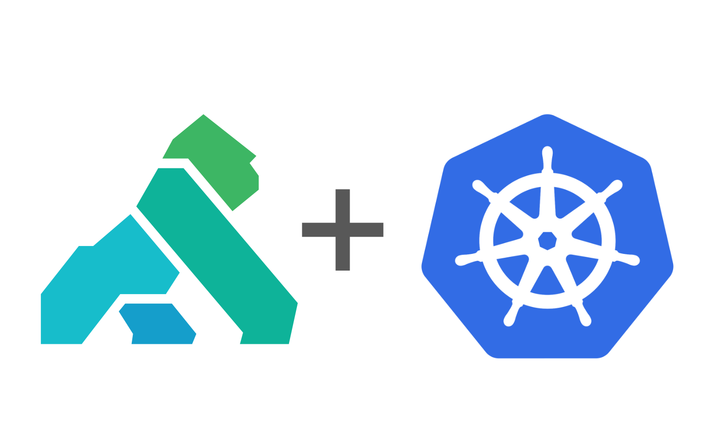
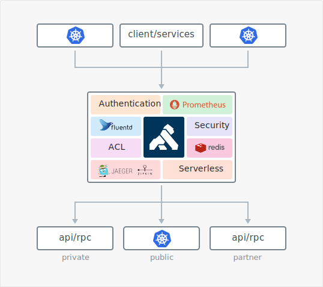

# Overview
Deploy the Kong API Gateway along with the Admin API to Kubernetes.  Use Konga to manage it.

# Why Kong API Gateway
Kong’s Ingress Controller implements authentication, transformations, and other functionalities across Kubernetes clusters with zero downtime.



## Deploying Kong Resources
```bash
> $ kubectl create -f kong_dbless.yaml
```
Once the resources have been created, get the Proxy IP and store as an enviornment variable.

```bash
export PROXY_IP=$(kubectl get -o jsonpath="{.status.loadBalancer.ingress[0].ip}" service -n kong kong-proxy)
```

###  Modify Resources
```bash
> $ kubectl apply -f kong_dbless.yaml
```

### Deleting Resources
```bash
> $ kubectl delete -f kong_dbless.yaml
```

## Deploying Konga

```bash
> $ kubectl apply -f konga.yaml
```